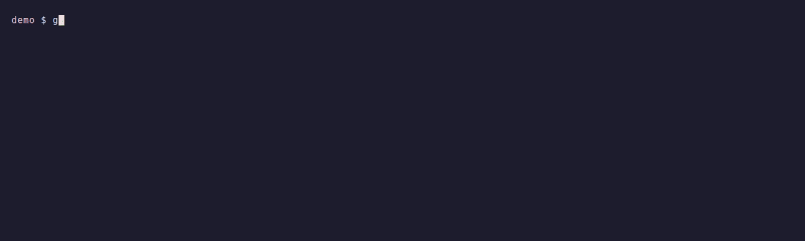
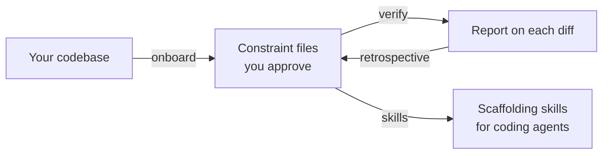

<h1 align="center">Luciole</h1>

<p align="center"><strong>Turn your codebase's unwritten conventions into checks.</strong></p>

<p align="center">
  <a href="LICENSE"></a>
  <a href="#quick-start"></a>
  <a href="#how-it-works"></a>
</p>

<p align="center"></p>

Your linters check the language. They don't know that *your* controllers take the logged-in
user as a `#[CurrentUser]` parameter instead of calling `$this->getUser()` (241 of 243 do),
or that *your* event subscribers never save an aggregate themselves but dispatch a command
(47 of 47). luciole reads your code, proposes those conventions as rules, measures them,
lets you approve them — then checks every change against them. Excerpt from a real run on
a Symfony project:

```markdown
## Constraints Check: FAILED ❌

Files checked: 13
Static rules checked: 30 (0 tokens)
Semantic rules checked: 33
Violations found: 1
Warnings: 2

### Semantic Violations

#### tests/Integration/Contract/Twig/ReminderEmailRenderingTest.php
- **integration-test~86b2eaf3** (MUST): A service pulled from the container is narrowed with `\assert($x instanceof X)` before use
  Narrowed with `self::assertInstanceOf(EmailRendererInterface::class, $renderer)`.
  The repository has 220 narrowings through `\assert` against 9 through `assertInstanceOf`.
```

No linter ships that rule: luciole found it in the code, measured it, and you approved it.

Static rules run as regex — no LLM, no tokens. Semantic rules are judged by Claude Code
agents or by Jev. Every run is recorded, so rules that never fire or never match get flagged.



## How it works

luciole runs alongside your existing linters and analysers, in three stages:

- **Onboarding:** agents propose rules from a sample of files, scripts measure their regex
  probes across each scope's full file list, a review keeps or drops each rule.
- **Verification:** static rules run as regex, without an LLM. Semantic rules are assessed
  by one of two [engines](#verification-engines): Claude Code agents, or Jev.
- **Retrospective:** past reports point to dead scopes and rules worth revisiting or moving
  into existing tooling.

Nothing is tied to a language: scopes come from the repository, static checks operate on
text. The examples use Symfony because that is where the kit was developed.

## What a constraint looks like

One plain Markdown file per file type, in `${QUALITY_ROOT}/code/constraints/`:

````markdown
---
paths:
  - "src/**/Controller/**/*.php"
---

## Static Rules

```rules
CTL-001 | present | #\[Route\(      | MUST have a #[Route] attribute
CTL-002 | absent  | ->getDoctrine\( | MUST NOT use ->getDoctrine()
CTL-004 | present | RoutePrefix::   | MUST use RoutePrefix constants | via=phpstan:proj.routePrefix
```

## Semantic Rules

- MUST: Inject the domain repository interface — not the infrastructure implementation
- SHOULD: Return the entity (created or modified)
````

Static rules run as a regex, line by line. Semantic rules are assessed by the selected
engine; SHOULD findings never block. A `via=` annotation declares that your own tooling
handles the rule, so the checker skips it. [`SPEC.md`](luciole/SPEC.md) defines
the format; `constraint-lint` checks it.

## Verification engines

Static rules always run locally, in the matcher. Only the semantic rules change engine:

| | `agent` (default) | `jev` |
|---|---|---|
| Who judges | Claude Code: the verify skill inlines small groups and dispatches `luciole:checker` agents for the rest | Jev, through the TypeSafe API — one request per file, one question per rule |
| Entry point | `/luciole:verify` | the same skill with `--engine=jev`, or the standalone `constraint-check` CLI |
| Needs | a Claude Code session | `TYPESAFE_API_KEY`; no agent, usable in CI from a plain shell |
| Sends out | files to the Claude session | semantic rules and file contents to TypeSafe |
| Limits | agent context | files over `--max-chars` (60,000) are not sent: the check is incomplete |

The verify skill uses `QUALITY_VERIFY_ENGINE` (see [Configuration](#configuration)),
overridable per run with `--engine=agent|jev`. `constraint-check` always uses Jev. Both
engines produce the same report and the same `json:verdict`.

## Quick start

In Claude Code:

```
/plugin marketplace add olivrobert/luciole
/plugin install luciole@olivier-robert
```

Then, inside your project:

```
/luciole:onboard
```

Onboarding proposes and reviews rules, then writes the constraint files for you to inspect:

- `${QUALITY_ROOT}/code/constraints/` — one constraint file per file type, derived from your
  code

After you approve those files, it generates:

- `.claude/skills/quality-{slug}/` — one scaffolding skill per scope. Each routes to its
  constraints file and to a reference file in the repository; the constraints take
  precedence over the reference file
- `.claude/skills/skill-mapping.md` — the file → skill map a technical plan consumes

See [Applying constraints](#applying-constraints) for ways to use them during development
or review.

Run verification when you want to check a change against the applicable constraints:

```
/luciole:verify              # current git diff
/luciole:verify src/Invoice  # a directory
/luciole:verify --reports=var/reports  # save reports
/luciole:verify --engine=jev         # override the configured engine
/luciole:verify --engine=agent       # use agent verification
```

For an agent-free semantic check, install the optional binaries with
`/luciole:install`, then run the TypeSafe-backed CLI:

```bash
constraint-check                          # current git diff
constraint-check src/Invoice              # a file or directory
constraint-check --dry-run --stdout        # inspect requests without calling the API
```

`TYPESAFE_API_KEY` comes from the environment, or else from the project's `.env.local`.

The gate passes only when verification is complete and there are no MUST violations. The
CLI exits `0` on success, `1` on violations, `2` on an incomplete check (API errors,
missing answers, unreadable or oversized files).

```
## Constraints Check: FAILED ❌
Files: 12 | Static: 31 | Semantic: 4 | Violations: 1 | Warnings: 0 | Errors: 0

- src/Controller/InvoiceController.php:42 CTL-002 (MUST): MUST NOT use ->getDoctrine()
```

Each run writes two files under `${QUALITY_ROOT}/code/reports/constraints/` (or
`--reports=<dir>`): `<run_ts>-constraints.json`, the run document (findings, verdict,
one measurement per rule), and `<run_ts>-constraints.md`, rendered from it for reading.
Both engines produce the same pair. `--out=<path>` also copies the document to a fixed path
a pipeline can read.

The terminal output ends with a `json:verdict` block, the document's `verdict`. In CI, gate
on `success` (or the exit status), not on `violations`: an incomplete check fails with zero
violations.

```json
{"success": false, "violations": 0, "warnings": 0, "errors": 1}
```

## Configuration

Artifacts live under `QUALITY_ROOT` (default `.ia/quality`): `code/` for the constraints,
`onboard/` for onboarding state. Onboarding asks for it once and writes it to
`.luciole.env` at the project root, to commit:

```bash
QUALITY_ROOT=.ia/quality
QUALITY_VERIFY_ENGINE=agent   # or jev
```

A developer who needs different values puts them in `.luciole.local.env`.
Precedence: process environment, `.luciole.local.env`, `.luciole.env`.

## Applying constraints

Three ways, combinable:

### 1. Use the skill mapping in the plan

Ask the planning agent to read `.claude/skills/skill-mapping.md` and associate each file to
create or modify with its applicable `quality-{slug}` skill. The implementing agent then
loads those skills, which point to the constraints and a repository reference file.

Add this to your task prompt or project instructions, such as `CLAUDE.md`:

```text
Read .claude/skills/skill-mapping.md before planning changes.
For each file to create or modify, include the applicable skill in the plan.
Load and follow that skill before implementing the change.
If no mapping applies, say so and follow the project's existing conventions.
```

For example, a plan entry could be: “Modify `src/Controller/InvoiceController.php` using
`quality-controller`.” Use the skill names actually listed in your project's mapping.

### 2. Review after development

Develop without the skills, then run `/luciole:verify`.

### 3. Let Claude select skills from their descriptions

Each generated skill's description names the files it applies to, so Claude Code can load
it on its own. Not guaranteed: name the skill explicitly, or verify afterward.

## How onboarding works

`/luciole:onboard` coordinates five steps, with approval before skill generation.
Pass a step name to run that step alone. State is stored on disk, so you can `/clear` between
calls to manage context on larger projects.

| Step | Invocation | What it does | Writes |
|---|---|---|---|
| 1 | `/luciole:onboard scope` | selects the file types and records the files in each scope | `scopes.json` |
| 2 | `/luciole:onboard generate` | proposes rules per type, validates their format, and measures available probes across each scope | `candidates/{slug}.json` |
| 3 | `/luciole:onboard review-scope [slug]` | a read-only reviewer judges one scope, an applier applies its findings | `findings/{slug}.json` |
| 4 | `/luciole:onboard render` | renders the constraints and the tooling backlog, runs the gate, asks for your approval | `constraints/{slug}.md`, `approval.json` |
| 5 | `/luciole:onboard skills` | after approval, one skill per scope, plus the mapping | `.claude/skills/` |

After `render`, you are asked to read and approve the constraint files before skills are
generated. Approval is tied to their contents; editing a constraint invalidates it.
Validation failures or unresolved candidates can also stop the run.

A generator reads a diverse sample of at most 15 files per scope. Scripts then measure
available probes across the scope's full file list. Review checks whether those probes
express the proposed rules and investigates candidates that measurement could not resolve.

## The measurement loop

Every run document carries one verdict per rule checked, clean or not — the `rules` array
of the demo run above:

```json
"rules": [
  { "rule": "controller#CTL-001", "kind": "static", "files": 1, "verdict": "pass", "hits": 0,
    "text": "MUST have a #[Route] attribute" },
  { "rule": "controller#CTL-002", "kind": "static", "files": 1, "verdict": "fail", "hits": 1,
    "text": "MUST NOT flush the EntityManager: mutations go through the command bus" }
]
```

A passing rule is recorded too: that is what lets a retrospective say "this rule found
nothing in N runs". Keep the reports (`--reports=<dir>`): they are the only archive.
`rule-stats report --reports=<glob>` turns them into per-rule statistics. A retrospective
uses them to flag globs matching no files, rules that never fire, and rules better moved
into your own tooling.

```
/luciole:retrospective   # proposes improvements — never applies them
/luciole:update       # applies a rule change, with your approval
```

## What the plugin ships

| Part | What it brings |
|---|---|
| **Engine** | [`SPEC.md`](luciole/SPEC.md) (normative grammar), the matcher, the format linter (`constraint-lint`), the optional TypeSafe CLI (`constraint-check`), the candidate measurer (`measure-candidates`), the measurement projection (`rule-stats`). |
| **Verification** | `/luciole:verify`, `/luciole:update`, `/luciole:retrospective`. |
| **Onboarding** | `/luciole:onboard`, alone for the whole run or with a step name (`scope`, `generate`, `review-scope`, `render`, `skills`). Generates constraints and scaffolding skills from the project. |

## Requirements

- Claude Code
- Node.js
- Git

<details>
<summary>How onboarding finds the engine binaries</summary>

Onboarding needs the engine binaries (`constraint-lint`, `measure-candidates`). Its
scripts resolve them on their own, in this order: the `CONSTRAINT_KIT_BIN` environment
variable (a directory), the plugin's own `bin/`, then the PATH. The first
onboarding step (`/luciole:onboard scope`) checks this before any agent runs.

Optional: `/luciole:install` puts `constraint-check`, `constraint-lint`,
`rule-stats` and `measure-candidates` on your PATH, for terminal and CI use, or when none
of the locations above applies.

</details>

## Tests

```bash
node --test '*/tests/*.test.mjs'
```

## License

MIT — see [LICENSE](LICENSE).
